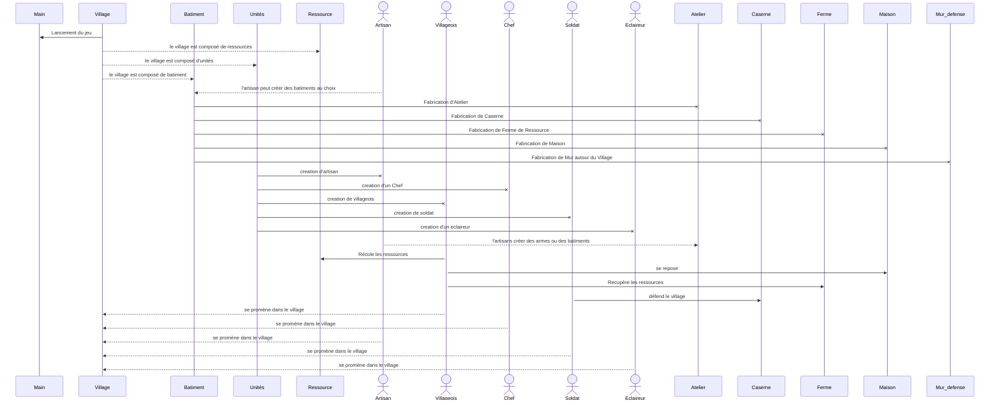

```mermaid
---
Legacy of Lands
---

sequenceDiagram
        participant  Main
        participant  Village
         Village->>Main: Lancement du jeu

        participant  Batiment
        participant  Unités
        participant  Ressource
        
        Village-->>Ressource: le village est composé de ressources
        Village-->>Unités: le village est composé d'unités
        Village-->>Batiment: le village est composé de batiment

        actor Artisan
        activate Artisan
        actor Villageois
        activate Villageois
        actor Chef
        activate Chef
        actor Soldat
        activate Soldat
        actor Eclaireur
        activate Eclaireur
        
            Artisan-->>Batiment: l'artisan peut créer des batiments au choix

                Batiment-xAtelier: Fabrication d'Atelier
                Batiment-xCaserne: Fabrication de Caserne
                Batiment-xFerme: Fabrication de Ferme de Ressource
                Batiment-xMaison: Fabrication de Maison
                Batiment-xMur_defense: Fabrication de Mur autour du Village


            Unités-xArtisan: creation d'artisan
            Unités-xChef: creation d'un Chef
            Unités-xVillageois: creation de villageois
            Unités-xSoldat: creation de soldat
            Unités-xEclaireur: creation d'un eclaireur

            Artisan-->>Atelier: l'artisans créer des armes ou des batiments
            
            Villageois->>Ressource: Récole les ressources
            Villageois->>Maison: se repose
            Villageois->>Ferme: Recupère les ressources


            Soldat->>Caserne: défend le village


            Villageois-->>Village: se promène dans le village
            Chef-->>Village: se promène dans le village
            Artisan-->>Village: se promène dans le village
            Soldat-->>Village: se promène dans le village
            Eclaireur-->>Village: se promène dans le village


```